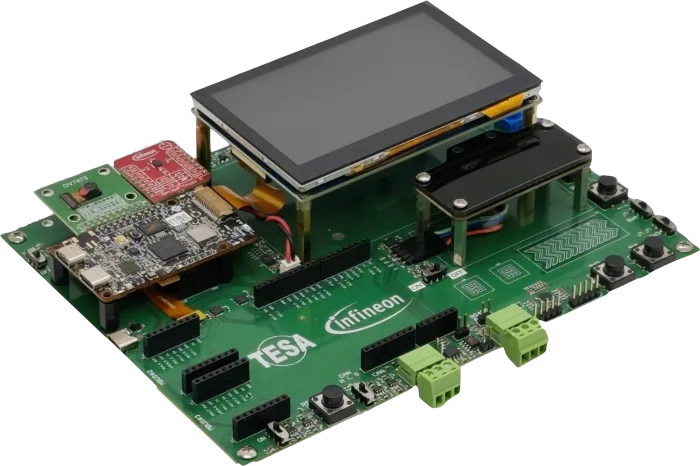
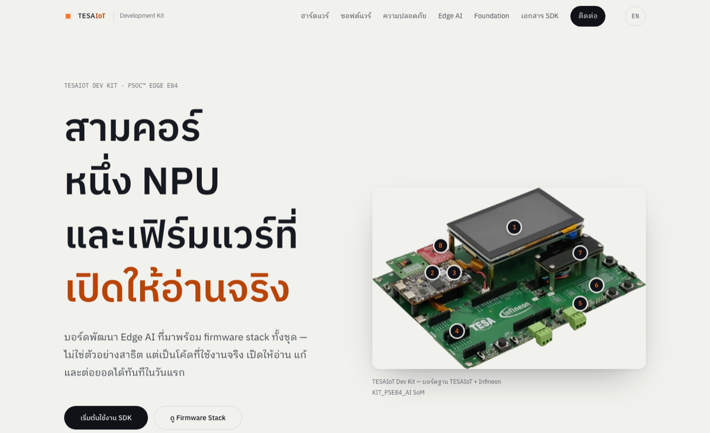
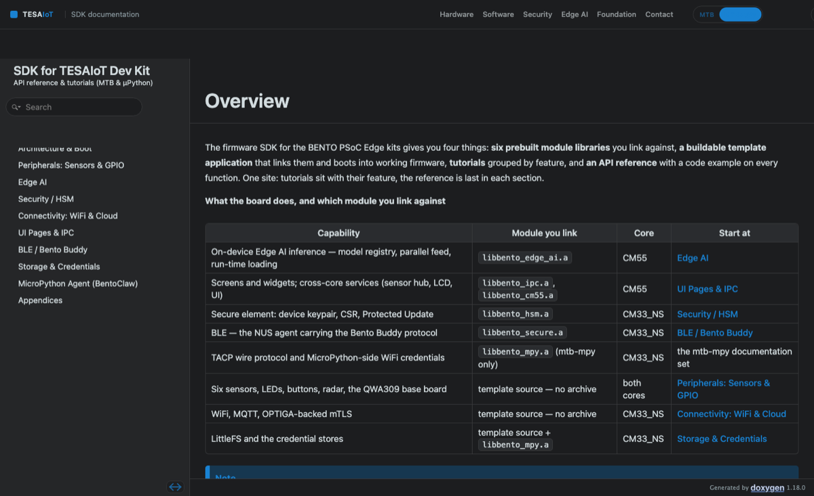

<div align="center">

# TESAIoT Firmware Stack &amp; SDK

**บอร์ดพัฒนา Edge AI สามคอร์ ที่มาพร้อมเฟิร์มแวร์ทั้งชุด — ไม่ใช่ตัวอย่างสาธิต**

[](https://tesaiot.github.io/tesaiot-pse84-devkit-sdk/)
[](LICENSE)
[](#ฮาร์ดแวร์โดยย่อ)
[](https://www.infineon.com/)

[**เอกสารฉบับเต็ม →**](https://tesaiot.github.io/tesaiot-pse84-devkit-sdk/) · [English](#english)



</div>

---

## นี่คืออะไร

เฟิร์มแวร์และ SDK สำหรับ **TESAIoT Development Kit** — บอร์ดพัฒนาบน Infineon
**PSoC™ Edge E84** ที่มีสามคอร์และ NPU

สิ่งที่อยู่ใน repo นี้คือ**เฟิร์มแวร์ตัวที่ทำงานอยู่จริงบนบอร์ด** ไม่ใช่ตัวอย่างสาธิตที่เขียนขึ้นมาประกอบเอกสาร
บูตขึ้นมาเป็นหน้าจอสัมผัสพร้อมเมนู อ่านเซนเซอร์ทุกตัว รัน MicroPython ต่อคลาวด์ด้วย TLS
และรันโมเดล Edge AI บน NPU — ทั้งหมดนี้เปิดให้อ่านและแก้ได้

**ทำไมถึงสำคัญ** — การเริ่มโปรเจกต์ Edge AI บน MCU สามคอร์ตามปกติ กินเวลาหลายเดือนไปกับงานที่ยังไม่ใช่
สินค้าของคุณเลย: ทำให้จอติด ทำให้คอร์คุยกันได้ ทำให้ TLS ต่อสำเร็จ ทำให้เซนเซอร์อ่านค่าถูก
งานส่วนนั้นทำเสร็จแล้วและอยู่ในนี้ คุณจึงเริ่มเขียนสิ่งที่เป็นของคุณได้ตั้งแต่ไฟล์แรก

## ทำไมถึงต่างจาก SDK ทั่วไป

**1 · เปิดให้อ่านจริง ไม่ใช่ไบนารีก้อนเดียว**
ซอร์ส C ประมาณ **237,000 บรรทัด** — ทุกหน้าจอ ทุกไดรเวอร์ ทั้ง BSP
ที่ปิดมีเพียง 6 ไลบรารี และเราบอกชัดว่าปิดอะไรและเพราะอะไร

**2 · ตรวจสอบได้ด้วยตัวเอง**
ไลบรารีทุกตัวเซ็นลายเซ็นดิจิทัลไว้ คำสั่งแรกที่คุณพิมพ์หลังแตกไฟล์คือ
`cd lib && ./verify.sh` แล้วคุณจะรู้เองว่าไม่มีอะไรถูกแก้ระหว่างทาง

**3 · เอกสารภาษาไทยที่เขียนสำหรับวิศวกร**
**838 หน้า สองภาษา** ศัพท์เทคนิคคงไว้เป็นภาษาอังกฤษตามที่ใช้จริงในวงการ
พร้อมตัวอย่างที่**คอมไพล์ผ่านจริง** ไม่ใช่โค้ดในเอกสารที่ลอกไปแล้วใช้ไม่ได้

**4 · Edge AI ที่รันได้ในวันแรก และต่อยอดได้ 4 ทาง**
โมเดล DEEPCRAFT™ ทำงานตั้งแต่แกะกล่อง และมีช่องว่างให้คุณใส่โมเดลของตัวเอง
โดย**ไม่ต้องแตะโค้ดที่เราปิด และไม่ต้องรอไลบรารีชุดใหม่จากเรา**

**5 · MicroPython มาแบบพร้อมใช้**
มาเป็น `prebuilt/libmicropython.a` — ไม่ต้องโหลด port 189 MB ไม่ต้อง build interpreter เอง
ถ้าต้องการแก้ตัว interpreter (เพิ่มโมดูล C หรือ freeze โมดูล Python) ให้ใช้ port ต้นทางของ Infineon:
[`Infineon/micropython-psoc-edge`](https://github.com/Infineon/micropython-psoc-edge) branch `psoc-edge-main`

**6 · เส้นทางถึงสินค้าจริง ไม่ใช่แค่ของเล่น**
HSM สำหรับตัวตนอุปกรณ์ · Protected Update สำหรับอัปเดตภาคสนาม ·
mTLS ที่กุญแจอยู่ในชิปตลอดเวลา — โครงสร้างเดียวกันรองรับตั้งแต่งานเรียนถึงการผลิต

<div align="center">


<br><sub>หน้าผลิตภัณฑ์และเอกสาร API — ทั้งคู่มีทั้งภาษาไทยและอังกฤษ</sub>
</div>

---

## เลือกเส้นทางที่ตรงกับวิธีทำงานของคุณ

**ไม่ใช่เลือกตามระดับความสามารถ** ทั้งสองแบบใช้ไลบรารีชุดเดียวกัน ฮาร์ดแวร์ชุดเดียวกัน เอกสารชุดเดียวกัน

| | **MTB only** | **MTB + MicroPython** |
|---|---|---|
| โฟลเดอร์ | `bento-firmware-template-mtb-only` | `bento-firmware-template-mtb-mpy` |
| ภาษา | C สามคอร์ | C + MicroPython |
| รอบการทดลอง | คอมไพล์ → flash (~10 นาที) | แก้แล้วรันทันที ผ่าน REPL |
| จุดแข็ง | คุมเวลาระดับไมโครวินาที · ใช้แรมน้อยสุด · ดีบักทีละคำสั่ง | เห็นผลทันที · คุยกับฮาร์ดแวร์สด ๆ · ผสม C กับ Python ได้ |
| เหมาะกับ | สินค้าที่ต้องผลิต · งานที่คุม latency · งานที่แบตเตอรี่จำกัด | การเรียนการสอน · งานต้นแบบ · โจทย์ที่ยังเปลี่ยนบ่อย |
| เอกสาร | 732 หน้า | 838 หน้า |

---

## เริ่มต้นใน 3 คำสั่ง

```bash
git clone https://github.com/tesaiot/tesaiot-pse84-devkit-sdk.git
cd tesaiot-pse84-devkit-sdk/bento-firmware-template-mtb-mpy
./setup.sh --build
```

`setup.sh` ตรวจเองว่าคุณถือ variant ไหน ขาดอะไร แล้วจัดการให้
**ทุกคำสั่งที่มันรันจะพิมพ์ให้เห็นก่อน** เพื่อให้คุณพิมพ์เองซ้ำได้เมื่อไม่มีสคริปต์

จากนั้น flash และ **ถอดสาย USB ออกจนสุด นับสิบ แล้วเสียบใหม่**

```bash
make program BENTO_WORKSPACE="$(cd .. && pwd)"
```

> **ทำไมต้องถอดสาย** — ไฟหน้าจอต้องการขอบสัญญาณ 0→1 แบบเย็น
> รีเซ็ตผ่าน debugger ไม่พอ ถ้าไม่ถอด จอจะดำ ซึ่งดูเหมือน flash ล้มเหลวทุกประการ

---

## เฟิร์มแวร์สำเร็จรูป

ทุก release แนบ `app_combined.hex` ที่ build แล้วมาให้ **และเป็นไฟล์เดียวกับที่เราแฟลชลงบอร์ดจริงเพื่อทดสอบ**
ไม่ใช่ build คนละรอบ — ตรวจได้ด้วย SHA-256

ตรวจว่าไฟล์ที่โหลดมาคือตัวเดียวกับที่เราทดสอบ โดยเทียบกับ `SHA256SUMS.txt`
ที่แนบมากับ release เดียวกัน

```bash
shasum -a 256 app_combined.hex
```

แฟลชด้วยคำสั่งเดียวจาก template ที่แตกไฟล์แล้ว

```bash
make program BENTO_WORKSPACE="$(cd .. && pwd)"
```

> **อย่าเรียก openocd ตรง ๆ ด้วย `-f target/cat1d.cfg`** — เราลองแล้ว มันได้
> `wrote 0 bytes` แล้วตามด้วย checksum mismatch เพราะอิมเมจกินพื้นที่ QSPI ภายนอก
> ซึ่งต้องให้ ModusToolbox ตั้งค่า SMIF bank ให้ก่อน และที่แย่กว่านั้นคือมัน
> **ทำให้เฟิร์มแวร์ที่กำลังรันตายไปเลย** ต้องแฟลชใหม่ ให้ใช้ `make program` เท่านั้น

---

## ชุดตัวอย่างโค้ด C

`proj_cm55/examples/` มีตัวอย่าง 30 ไฟล์ จัดตามความสามารถของบอร์ด ไม่ใช่ตามชื่อไลบรารี
ทุกไฟล์อ้างอิงเลขขาและค่าคอนฟิกจากเฟิร์มแวร์ที่รันจริง พร้อมเลขบรรทัดต้นทาง

| กลุ่ม | เนื้อหา |
|---|---|
| `display/` | LVGL, หน้าจอ, ฟอนต์ไทย, สไปรต์ |
| `edge_ai/` | เลือกโมเดล อ่านผลทำนาย จัดการชุดโมเดล |
| `sensors/` | BMI270, BMM350, DPS368, SHT40, เรดาร์ |
| `io/` | GPIO, ปุ่ม, โพเทนชิโอมิเตอร์, RGB matrix |
| `connectivity/` | WiFi, MQTT, HTTP |
| `security/` | OPTIGA Trust M — คีย์ ใบรับรอง ตัวนับ |
| `storage/` | LittleFS, ที่เก็บข้อมูลลับ |

ตัวอย่างถูก `CY_IGNORE` ไว้โดยค่าเริ่มต้น จึง**ไม่กระทบเฟิร์มแวร์ของคุณเลย** จนกว่าจะเปิดเอง

```bash
make build -j ENABLE_PAGE_EXAMPLES=1     # เพิ่มหน้า "SDK Examples" บนจอ
```

---

## เตรียมสภาพแวดล้อม

### สิ่งที่ต้องมีเหมือนกันทุกระบบปฏิบัติการ

| | เวอร์ชัน | หมายเหตุ |
|---|---|---|
| **ModusToolbox™** | **3.6 เท่านั้น** | ใหม่กว่าไม่ได้ดีกว่า ดูเหตุผลข้างล่าง |
| Arm GCC | 14.2.1 | มาพร้อม ModusToolbox ไม่ต้องลงแยก |
| Git | ใดก็ได้ | |
| พื้นที่ว่าง | **~4 GB** | `mtb_shared` 1.9 GB + repo + build |

> **ทำไมตรึงที่ 3.6** — Configurator รุ่นใหม่กว่าจะสร้างการตั้งค่า BSP ใหม่จาก `design.modus`
> แล้วออก notice ที่ `-Werror=cpp` เปลี่ยนเป็น error ในไฟล์ที่คุณไม่เคยแตะ
> ถ้าจะข้ามการตรึงให้ตั้ง `BENTO_MTB_VERSION` และเตรียมตรวจสอบใหม่เอง

---

### macOS

```bash
# 1. ติดตั้ง ModusToolbox 3.6 จาก infineon.com (ไฟล์ .dmg)

# 2. bash 4+ — macOS มาพร้อม bash 3.2 ซึ่งสคริปต์เราใช้ไม่ได้
brew install bash

# 3. ตั้ง PATH ให้ bash ใหม่มาก่อน แล้วตามด้วย toolchain
cat >> ~/.zshrc <<'EOT'
export PATH="/opt/homebrew/bin:$PATH"
export PATH="/Applications/mtb-gcc-arm-eabi/14.2.1/gcc/bin:$PATH"
export PATH="/Applications/ModusToolbox/tools_3.6/modus-shell/bin:$PATH"
EOT
source ~/.zshrc

# 4. ตรวจ
bash --version | head -1          # ต้องเป็น 5.x ไม่ใช่ 3.2
arm-none-eabi-gcc --version | head -1
```

> Apple Silicon ใช้ `/opt/homebrew` · Intel ใช้ `/usr/local`

---

### Windows

ModusToolbox มาพร้อม **modus-shell** ซึ่งเป็นสภาพแวดล้อมแบบ Unix
**ให้ทำงานในนั้น ไม่ใช่ใน PowerShell หรือ cmd** เพราะ Makefile ของ ModusToolbox
ต้องการเครื่องมือแบบ POSIX

```
1. ติดตั้ง ModusToolbox 3.6 จาก infineon.com (ไฟล์ .exe)

2. เปิด "modus-shell" จาก Start Menu
   (ไม่ใช่ PowerShell · ไม่ใช่ Command Prompt)

3. ในหน้าต่างนั้น ตรวจว่าพร้อม:
       bash --version
       arm-none-eabi-gcc --version

4. ทำงานต่อจากที่นั่นเหมือนบน Linux ทุกประการ
```

**ข้อควรระวังบน Windows**

- **เก็บโปรเจกต์ไว้ใกล้ราก** เช่น `C:\tesaiot\` — Windows จำกัดความยาว path
  ที่ 260 ตัวอักษร และ path ของ ModusToolbox ยาวมาก ถ้าวางลึกจะ build ล้มด้วย
  error ที่ไม่บอกสาเหตุ
- **อย่าใช้ OneDrive หรือโฟลเดอร์ที่ sync อัตโนมัติ** — Ninja แคช object ตามเวลาไฟล์
  ตัว sync จะรักษาเวลาเดิมไว้ ทำให้ลิงก์ object เก่าโดยไม่รู้ตัว
- **ปิด antivirus ที่สแกน realtime สำหรับโฟลเดอร์นี้** ไม่งั้น build ช้ามาก
- ถ้ามีชื่อผู้ใช้เป็นภาษาไทยหรือมีช่องว่าง ให้ย้ายโปรเจกต์ออกจาก `C:\Users\...`

---

### Linux (Ubuntu / Debian)

```bash
# 1. dependency ของ ModusToolbox
sudo apt update
sudo apt install -y build-essential git make cmake python3 python3-pip \
                    libglib2.0-0 libgl1 libusb-1.0-0 udev

# 2. ติดตั้ง ModusToolbox 3.6 จาก infineon.com (ไฟล์ .deb หรือ .tar.gz)
sudo dpkg -i ModusToolbox_3.6*.deb

# 3. กฎ udev สำหรับ KitProg — จำเป็น ไม่งั้นต้อง sudo ทุกครั้งที่ flash
sudo cp /opt/Tools/ModusToolbox/tools_3.6/fw-loader/udev_rules/*.rules \
        /etc/udev/rules.d/
sudo udevadm control --reload-rules && sudo udevadm trigger

# 4. PATH
cat >> ~/.bashrc <<'EOT'
export PATH="/opt/Tools/ModusToolbox/tools_3.6/gcc/bin:$PATH"
export PATH="/opt/Tools/ModusToolbox/tools_3.6/modus-shell/bin:$PATH"
EOT
source ~/.bashrc

# 5. ตรวจ
arm-none-eabi-gcc --version | head -1
```

> **ต้องออกจากระบบแล้วเข้าใหม่หลังเพิ่มกฎ udev** ไม่งั้นสิทธิ์ยังไม่มีผล

---

### ตรวจว่าพร้อมจริง

```bash
cd bento-firmware-template-mtb-mpy
./setup.sh --check
```

สคริปต์จะบอกทีละข้อว่ามีอะไรและขาดอะไร โดยไม่แก้อะไรเลย

---

## ฮาร์ดแวร์โดยย่อ

| | |
|---|---|
| **SoC** | Infineon PSoC™ Edge E84 — `PSE846GPS2DBZC4A` |
| **โดเมนสมรรถนะสูง** | Arm® Cortex®-M55 **400 MHz** + Helium DSP + Ethos™-U55 NPU |
| **โดเมนประหยัดพลังงาน** | Arm® Cortex®-M33 **200 MHz** + NNLite สำหรับงาน always-on |
| **ความปลอดภัย** | Arm® TrustZone® · รองรับ OPTIGA™ Trust M (โมดูลเสียบ แยกจำหน่าย) |
| **หน่วยความจำ** | QSPI NOR 512 Mb · Octal HYPERRAM™ 128 Mb · LittleFS 52 MB |
| **ไร้สาย** | Infineon CYW55513 — Wi-Fi 6 dual-band + Bluetooth LE |
| **เซนเซอร์** | BMI270 · BMM350 · DPS368 · SHT40 · BGT60TR13C radar 60 GHz · OV7675 · ไมค์ PDM |
| **จอ** | 4.3 นิ้ว MIPI DSI สัมผัสได้ · LVGL 9 พร้อมฟอนต์ไทยในตัว |
| **ส่วนขยาย** | mikroBUS™ ×3 · Arduino shield · CAN · RS-485 · CapSense · RGB LED matrix |

---

## สัญญาอนุญาต

ซอร์สที่ TESA เขียนเองอยู่ภายใต้ **Apache License 2.0**
คำอธิบายภาษาไทยอยู่ที่ [`LICENSE-TH.md`](LICENSE-TH.md) — ฉบับที่มีผลผูกพันคือ
[`LICENSE`](LICENSE) ภาษาอังกฤษ

**ส่วนที่ไม่ได้อยู่ภายใต้ Apache-2.0** — โมเดล Edge AI ที่ export จาก DEEPCRAFT™ Studio
เป็นลิขสิทธิ์ของ **Imagimob AB** บริษัทในเครือ Infineon Technologies
ใช้ที่นี่เพื่อการวิจัยและการเรียนการสอนเท่านั้น **ไม่ใช่เพื่อการพาณิชย์**
หากจะนำไปทำสินค้า ให้ตกลงกับ Infineon และ Imagimob ก่อน
รายละเอียดครบใน [`THIRD_PARTY_NOTICES.md`](THIRD_PARTY_NOTICES.md)

---

## ความสามารถที่ยืนยันแล้วบนบอร์ด

เฟิร์มแวร์ที่แนบมากับ release ถูกแฟลชและใช้งานจริงบน TESAIoT Dev Kit

| | |
|---|---|
| หน้าจอสัมผัสและเมนู | ใช้งานได้ |
| MicroPython | 44 โมดูล (เฉพาะ variant `mtb_mpy`) |
| เซนเซอร์ | DPS368 · SHT40 · BMM350 · BMI270 · เรดาร์ |
| Edge AI | 6 โมเดลพร้อมใช้ |
| WiFi | เชื่อมต่อและออกอินเทอร์เน็ตได้ |
| MQTT | เชื่อมต่อ broker ด้วย mTLS + OPTIGA |
| HTTPS | ส่ง telemetry ขึ้นแพลตฟอร์มได้ |
| OPTIGA Trust M | ใบรับรองอุปกรณ์ · ลายเซ็น ECDSA · ตัวเลขสุ่ม |

variant `mtb` เป็น C ล้วน ไม่มีคอนโซล Python การเข้าถึงเซนเซอร์และ OPTIGA
เขียนด้วย C ตามตัวอย่างใน `proj_cm55/examples/`

---

<div align="center">
<a name="english"></a>

## English

</div>

Firmware and SDK for the **TESAIoT Development Kit** — an Edge AI board on the
Infineon **PSoC™ Edge E84**, three Arm cores with an NPU. What is here is the
firmware that runs the product, not a demonstration.

**Why it exists.** Starting an Edge AI project on a three-core MCU normally
costs months before you write a line that is yours: bringing up the display,
getting the cores to talk, making TLS connect, reading the sensors correctly.
This SDK removes that work. You start from a board that already does all of it.

**What you get**

- **~237,000 lines of C, open to read** — every screen, every driver, the whole BSP
- **Six prebuilt libraries** exporting 284 public API entries, with an honest `api.txt`
- **A signature you verify yourself** — `cd lib && ./verify.sh`, the first command after unzipping
- **838 pages of documentation** in Thai and English, with examples that genuinely compile
- **Edge AI running on day one**, and four documented ways to add your own model without touching closed code
- **A path to production** — HSM device identity, Protected Update, mTLS with the key inside the secure element

**Two paths, equal in quality.** `mtb-only` is plain C across three cores:
microsecond timing, smallest footprint, instruction-level debugging — for
products going to manufacture. `mtb-mpy` adds MicroPython embedded in the
firmware: edit and run, no compile, no flash — for teaching, prototyping, and
work whose requirements are still moving. Both share the same libraries, the
same hardware and the same documentation.

**Getting started**

```bash
git clone https://github.com/tesaiot/tesaiot-pse84-devkit-sdk.git
cd tesaiot-pse84-devkit-sdk/bento-firmware-template-mtb-mpy   # or -mtb-only
./setup.sh --build
```

`setup.sh` detects which variant you hold, tells you what is missing, and
fetches it. Every command it runs is printed first, so you can reach the same
result by hand. Requires **ModusToolbox 3.6 specifically** — see the Thai
section above for per-platform setup on macOS, Windows and Linux, including the
Windows path-length and file-sync traps and the Linux udev rules.

After flashing, **unplug the USB cable completely, wait ten seconds, and plug
it back in.** A debugger reset is not enough: the display backlight needs a
cold 0→1 edge and stays dark otherwise, which looks exactly like a failed flash.

**Licence.** TESA's own source is Apache-2.0. The Edge AI models exported from
DEEPCRAFT™ Studio are copyright **Imagimob AB**, an Infineon Technologies
company, are **not** covered by that grant, and are used here for research and
teaching rather than commercial deployment. See
[`THIRD_PARTY_NOTICES.md`](THIRD_PARTY_NOTICES.md) before shipping anything
derived from them.

**Verified on hardware.** The firmware attached to the release runs on a
TESAIoT Dev Kit: touch display and menus, MicroPython (44 modules, `mtb_mpy`
only), the DPS368 / SHT40 / BMM350 / BMI270 sensors and the radar, six Edge AI
models, Wi-Fi, MQTT over mTLS with OPTIGA, HTTPS telemetry, and the OPTIGA
device certificate with ECDSA signing.

---

<div align="center">

**[เอกสารฉบับเต็ม / Full documentation →](https://tesaiot.github.io/tesaiot-pse84-devkit-sdk/)**

<sub>PSoC™, OPTIGA™, DEEPCRAFT™ และ ModusToolbox™ เป็นเครื่องหมายการค้าของ Infineon Technologies AG<br>
ดูแลโดยสมาคมสมองกลฝังตัวไทย — Thai Embedded Systems Association (TESA)</sub>

</div>
