# TESAIoT Dev Kit — เทมเพลตเฟิร์มแวร์ภาษา C ล้วน (mtb-only)

> English: [README.en.md](README.en.md)

เฟิร์มแวร์ที่รันอยู่บน **TESAIoT Dev Kit** (Infineon PSoC™ Edge E84 AI Kit
บนบอร์ดฐาน TESAIoT QWA309) ในรูปโปรเจกต์ ModusToolbox™ ที่อ่าน แก้ และนำไปทำ
สินค้าต่อได้ เป็นภาษา C บน FreeRTOS ทั้งสามคอร์ ไม่มี MicroPython ไม่มี virtual
machine ไม่มีชั้นสคริปต์ สิ่งที่ build ออกมาคือสิ่งที่รันจริง

---

## 1. แพ็กเกจนี้คืออะไร

| | |
|---|---|
| ภาษา | C, FreeRTOS, LVGL บน CM55 |
| เครื่องมือ | ModusToolbox 3.6 และ GNU Arm toolchain ที่มากับมัน |
| คอร์ | CM33 secure (บูตอย่างเดียว), CM33 non-secure (Wi-Fi เซนเซอร์ คลาวด์ OPTIGA), CM55 (จอแสดงผล หน้า UI ทุกหน้า Edge AI บน NPU เรดาร์ USB host) |
| ซอร์ส | หน้า UI ทุกหน้า ไดรเวอร์เซนเซอร์ทุกตัว BSP ชั้นรับส่ง IPC, Wi-Fi, MQTT/TLS และ storage |
| ไลบรารีที่ build มาแล้ว | 5 ไฟล์ archive ใน `lib/` แต่ละไฟล์มี header และ `api.txt` และมี manifest หนึ่งไฟล์ที่เซ็นลายเซ็นดิจิทัลไว้ ระบุ SHA-256 ของทุกไฟล์ใน `lib/` (ข้อ 6) |

สองสิ่งที่ variant นี้ **ไม่มี** โดยตั้งใจ:

- **ไม่มี MicroPython** ไม่มี REPL ไม่มี `/main.py` และไม่มีโมดูล Python
  โค้ดของคุณเป็นภาษา C คือ task ของ FreeRTOS บน CM33_NS และหน้า LVGL บน CM55
- **ไม่มีคอนโซลของ BENTO IDE** คอนโซลของ IDE คุยกับบอร์ดผ่านช่องทางของ MicroPython
  ซึ่ง variant นี้ไม่มี แต่ Remote Flash ใน IDE ยัง flash ไฟล์ hex ของ C-only ที่เผยแพร่
  ได้ ส่วนเฟิร์มแวร์ที่คุณ build เองให้ใช้ `make program` ผ่าน KitProg3 (ข้อ 3)

**จะรู้ได้อย่างไรว่าบอร์ดทำงานอยู่** เมื่อไม่มี REPL หลักฐานว่าบอร์ดยังทำงานคือ
heartbeat บนพอร์ต USB serial ของ KitProg3 (115200 8N1) หนึ่งบรรทัดทุก 10 วินาที
บอกเวลานับจากบูตเป็นวินาทีและจำนวน task ของ FreeRTOS ตัวอย่างเช่น

```
[HB] t=30s tasks=27
```

ค่าตั้งและเครือข่าย Wi-Fi ที่บันทึกไว้เก็บผ่านชั้น storage ภาษา C
(`bento_libs/claw/common/storage_c/`) ในรูปแบบเดียวกับที่ variant MicroPython
เขียน บอร์ดจึงสลับไปมาระหว่างสอง variant ได้โดยไม่เสียค่าเหล่านี้

## 2. การได้มา: ไฟล์ zip ของ release หรือ clone แล้วเติม `lib/`

**ไฟล์ zip ของ release คือแพ็กเกจที่ครบ** ดาวน์โหลด
`bento-firmware-template-mtb-only.zip` จาก release `fw-c-only-v1.13.0` ของ
[tesaiot/tesaiot-pse84-devkit-sdk](https://github.com/tesaiot/tesaiot-pse84-devkit-sdk/releases)
แตกไฟล์ แล้วตรวจไลบรารีก่อนทำอย่างอื่น:

```bash
unzip bento-firmware-template-mtb-only.zip
cd bento-firmware-template-mtb-only
(cd lib && ./verify.sh)        # ตรวจลายเซ็น ECDSA ของ manifest แล้วตรวจ SHA-256 ของทุกไฟล์
```

**การ git clone อย่างเดียวไม่พอ** repository เก็บซอร์สไว้ แต่ไม่เก็บไฟล์ archive
`.a` ทั้ง 5 ไฟล์ (git ไม่ติดตาม `*.a`) โฟลเดอร์ `lib/` ใน clone จึงมีไฟล์ header
และ `verify.sh` แต่ไม่มี archive เลย และการ link จะล้มเหลว ถ้าจะทำงานจาก clone ให้นำ `lib/` จากไฟล์ zip ของ release
**เวอร์ชันเดียวกัน** มาใส่ แล้วตรวจที่นั่น:

```bash
# จากไฟล์ zip ที่แตกแล้ว ไปยัง clone ของคุณ
rsync -a bento-firmware-template-mtb-only/lib/ <your-clone>/bento-firmware-template-mtb-only/lib/
(cd <your-clone>/bento-firmware-template-mtb-only/lib && ./verify.sh)
```

อย่าใช้ `lib/` ของเวอร์ชันหนึ่งกับซอร์สของอีกเวอร์ชันหนึ่ง

## 3. Build และ flash

ต้องมี ModusToolbox 3.6 (Configurator รุ่นใหม่กว่าจะสร้างไฟล์ของ BSP ใหม่และทำให้
build พัง), bash รุ่น 4 ขึ้นไป (บน macOS ใช้ bash ของ Homebrew) และพื้นที่ราว 2 GB
สำหรับ `mtb_shared` เทมเพลตคาดว่าจะวางแบบนี้ และหา workspace ที่ระดับเหนือตัวเอง
หนึ่งชั้น:

```
<workspace ของคุณ>/
  mtb_shared/                         สร้างโดย make getlibs
  bento-firmware-template-mtb-only/   โฟลเดอร์นี้
```

**1. ดึงไลบรารี ทีละโปรเจกต์** ไม่มี `getlibs` ที่ระดับบนสุด:

```bash
for p in proj_cm33_s proj_cm33_ns proj_cm55; do (cd $p && make getlibs); done
```

**2. ใส่ patch ให้ไลบรารีที่ต้องแก้** มี 5 asset ที่ต้องแก้รวม 11 ไฟล์ ซึ่ง
`getlibs` ให้ไม่ได้ ไฟล์ diff มากับแพ็กเกจใน `third_party_patches/` ถ้ายังไม่ได้ใส่
build จะไม่เริ่มและบอกว่าขาดอะไร:

```bash
cd ../mtb_shared
( for p in $(cat ../bento-firmware-template-mtb-only/third_party_patches/series); do
    patch -p1 -F0 --forward < "../bento-firmware-template-mtb-only/third_party_patches/$p" || exit 1
  done && shasum -a 256 -c ../bento-firmware-template-mtb-only/third_party_patches/PATCHED.sha256 )
cd ../bento-firmware-template-mtb-only
```

วงเล็บช่วยไม่ให้ terminal ของคุณปิดเมื่อมีข้อผิดพลาด ให้รันเพียงครั้งเดียว ถ้ารันซ้ำ
`patch` จะแจ้งว่า patch ถูกใส่ไปแล้วและหยุด ซึ่งเป็นเรื่องปกติ ให้รันบรรทัด `shasum`
เพียงบรรทัดเดียวเพื่อยืนยันแทน

**3. Build และโปรแกรมลงบอร์ด**

```bash
make build -j          # สามคอร์ ต้องเห็น "Build complete" ครบทุกคอร์
make program           # ผ่าน KitProg3
```

จากนั้น **ตัดไฟบอร์ดแล้วเสียบใหม่** (ถอด USB แล้วเสียบกลับ) การ reset ด้วย debugger
ไม่พอ ไฟพื้นหลังของจอต้องเริ่มจากไฟดับจริง มิฉะนั้นจอจะมืดค้าง ซึ่งดูเหมือน flash
ไม่สำเร็จทั้งที่สำเร็จแล้ว

`./setup.sh --check` บอกว่าขาดอะไร ส่วน `./setup.sh --build` ทำขั้นที่ 1 และ 3 ให้
(ทำขั้นที่ 2 เองก่อน) และ `./bento.sh` แสดงรายการเมนู เปิดปิดเมนู และรัน `verify`

**อย่าตรวจบอร์ดที่กำลังรันผ่าน openocd** การต่อ debugger เข้ากับบอร์ดที่กำลังรันจะ
ทำให้บอร์ดหยุด ให้ดู heartbeat แทน

## 4. หน้าจอมีอะไรบ้าง

บอร์ดบูตเข้าสู่หน้า Home แบบสัมผัส การ์ดแต่ละใบเปิดหนึ่งหน้า ซอร์สของทุกหน้าอยู่ใต้
`proj_cm55/modules/page-components/` การ์ดเรียงตามลำดับดังนี้

1. Sensor Dashboard
2. GPIO & RGB Matrix
3. Edge AI
4. HSM Security
5. Smart Watch
6. Animation
7. BENTO Playground
8. Joystick
9. BENTO Claw
10. Wi-Fi Setting

ภาพด้านล่างถ่ายจากรุ่นนี้ที่รันบน TESAIoT Dev Kit (800x480) เส้นแนวนอนบาง ๆ ในบางภาพ
เกิดจากการจับภาพ ซึ่งอ่านหน่วยความจำของจอขณะกำลังวาดเฟรม จอจริงไม่มีเส้นเหล่านี้
มีสองค่าที่ปิดไว้ด้วยแถบสีเทา คือหมายเลขประจำตัวของ secure element และรายชื่อเครือข่าย
Wi-Fi ที่สแกนพบ

**Home** แถวการ์ดเลื่อนไปทางข้างได้ แถบค่าเซนเซอร์สดแสดง IMU ทิศเข็มทิศ อุณหภูมิ
ความชื้น การสัมผัส และค่าลูกบิด

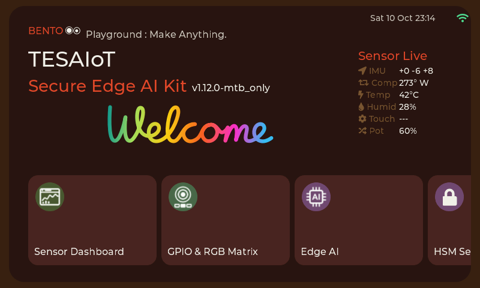
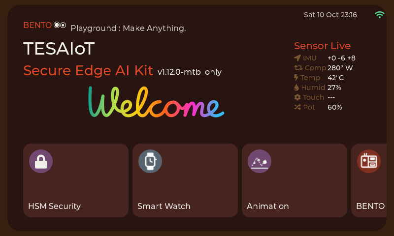
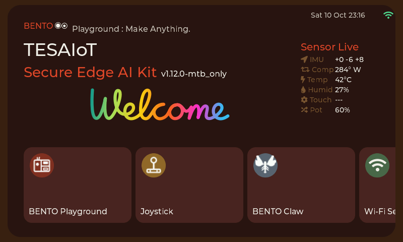

**Sensor Dashboard** กราฟ IMU ทิศจากแมกนีโตมิเตอร์ ความดัน อุณหภูมิและความชื้น
CapSense การตรวจจับคนด้วยเรดาร์ และจอยสติ๊ก USB

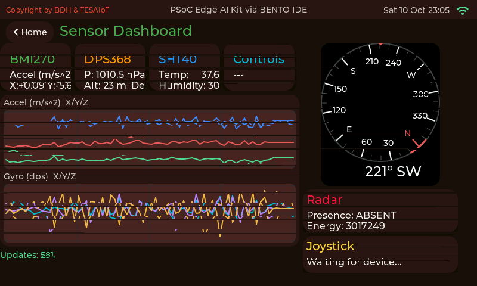

**GPIO & RGB Matrix** บอร์ดฐาน QWA309: ลูกบิดแต่ละตัวเป็น mV และค่า raw พร้อมชื่อขา
ปุ่มกดตามชื่อขา สถานะการเชื่อมต่อ CapSense, SW1-SW4 และ RGB matrix ขนาด 16x8
เลื่อนลงเพื่ออ่านหมายเหตุว่า E84 อ่านอะไรได้และอ่านอะไรไม่ได้

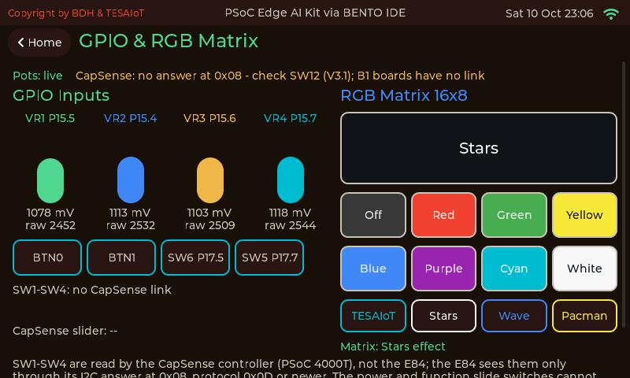
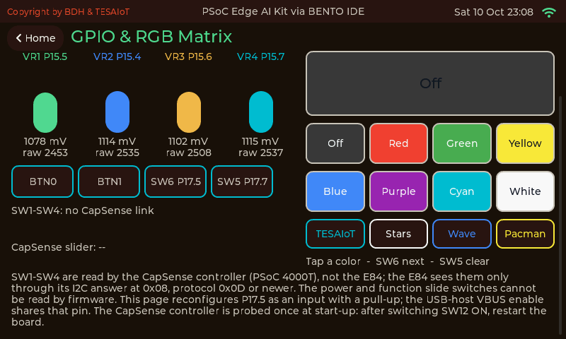

**Edge AI** เลือกโมเดลจากรายการ กด Load แล้วดูคะแนนของแต่ละคลาส
template นี้มี ready model ของ Siren, Cough และ Factory Alarm (DEEPCRAFT™ Ready Models
ของ Infineon โดย Imagimob AB รุ่นสำหรับการประเมิน) สำหรับการศึกษาและการประเมินที่ไม่ใช่เชิงพาณิชย์
อยู่ด้วย นอกเหนือจากโมเดล motion, audio และ radar (`proj_cm55/modules/ai_models/README.md`)
ภาพนี้แสดงรายการ Siren ที่ถูกเลือก แต่คำอธิบายและคลาสบนจอเป็นของโมเดล factory alarm
ซึ่งเป็นการแสดงผลผิดที่จะแก้ในรุ่นถัดไป

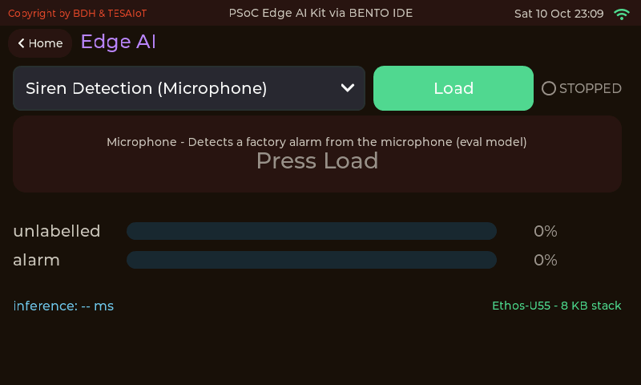

**HSM Security** secure element OPTIGA™ Trust M: ตัวตนของชิป ช่องใบรับรองและกุญแจ
ตัวนับ และสถานะ หมายเลขประจำตัวถูกปิดไว้ในภาพนี้

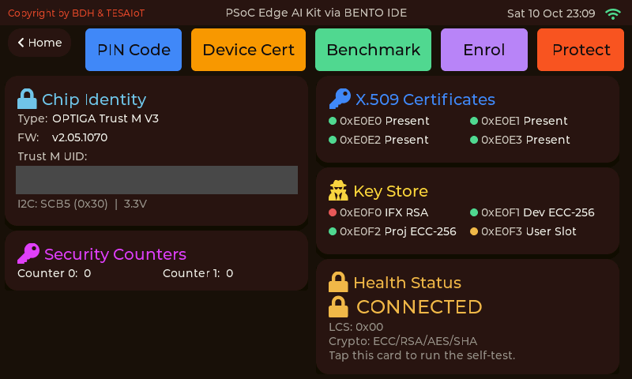

**Smart Watch** ตัวอย่างหน้าปัดนาฬิกาทรงกลม ข้อมูลที่แสดงเป็นค่าตัวอย่างคงที่

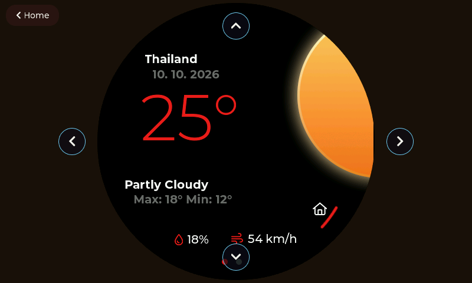

**Animation** ภาพเคลื่อนไหวแบบ Lottie ที่เล่นด้วย ThorVG

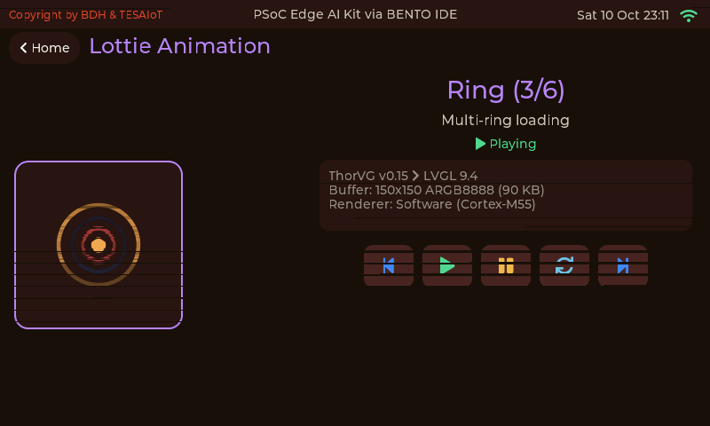

**BENTO Playground** หน้าจอว่างสำหรับให้โค้ดของคุณวาดลงไป

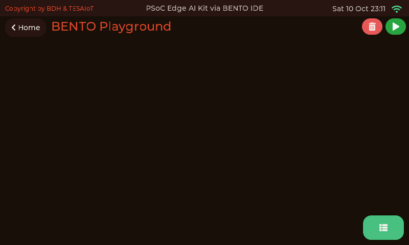

**Joystick** จอยเกม USB ที่เสียบเข้าพอร์ต host ในภาพกำลังรออุปกรณ์

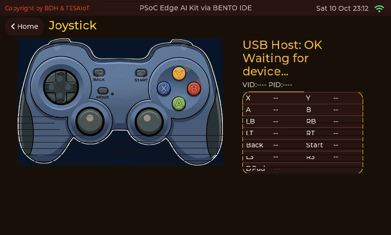

**BENTO Claw** หน้าสถานะของ agent ใน variant นี้ไม่มีอะไรส่งข้อมูลมาให้ จึงแสดง
สถานะว่าง

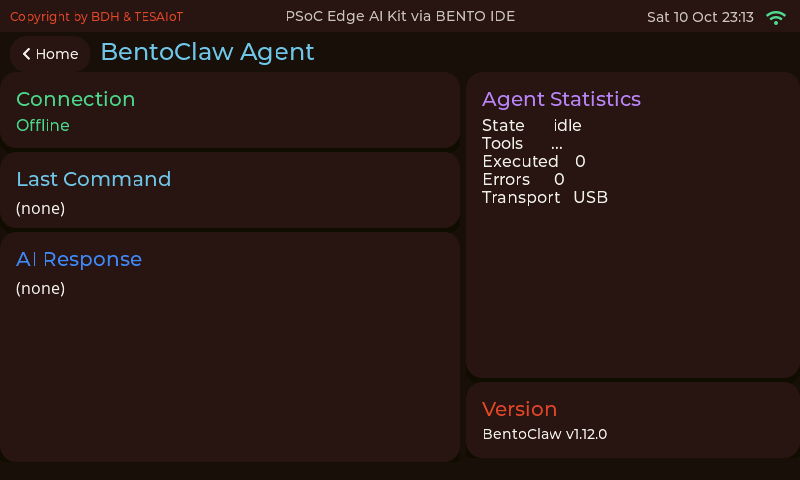

**Wi-Fi Setting** สแกน เชื่อมต่อ และเครือข่ายที่บันทึกไว้ รายชื่อที่สแกนพบถูกปิดไว้ในภาพนี้

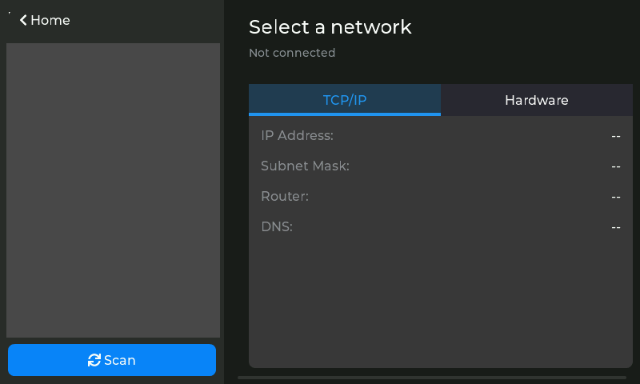

## 5. บอร์ดฐาน QWA309

สวิตช์ ลูกบิด และ header ทุกตัวบนบอร์ดฐาน แต่ละตัวต่อเข้าขาใด และเฟิร์มแวร์อ่านอะไร
ได้หรือไม่ได้ อยู่ในบทเอกสาร **J7 — บอร์ดฐาน QWA309: คู่มือฮาร์ดแวร์** ในแพ็กเกจนี้
อยู่ที่ `docs/html/th/group__j7__qwa309__baseboard.html` (ภาษาอังกฤษ:
`docs/html/group__j7__qwa309__baseboard.html`) และบน
[เว็บไซต์เอกสาร](https://tesaiot.github.io/tesaiot-pse84-devkit-sdk/)

อ่านก่อนต่อสายใด ๆ สามเรื่องจากบทนั้น:

- **อย่ากดปุ่มบน P17.5 ก่อนเปิดหน้า GPIO & RGB Matrix** ตอนบูต BSP ขับ P17.5 เป็น
  เอาต์พุต high (ขานี้เป็นทั้งสาย reset ของกล้องและขาเปิด VBUS ของ USB host) และ
  ปุ่มต่อขานี้ลงกราวด์ตรง ๆ หน้านั้นตั้งขาใหม่เป็นอินพุตพร้อม pull-up เมื่อเปิดครั้งแรก
- **SW1 ถึง SW4 ไม่ได้ต่อเข้า E84** ตัวควบคุม CapSense บนบอร์ดฐานเป็นผู้อ่าน แล้ว
  รายงานผ่าน I2C ที่ address 0x08 และรายงานได้เฉพาะเฟิร์มแวร์ของมันที่ใช้ protocol 0x0D
  หรือ 0x0E การเชื่อมต่อต้องเปิด SW12 แล้วเริ่มระบบใหม่
  การถอดรหัสทดสอบบนเครื่องคอมพิวเตอร์เท่านั้น เพราะไม่มีบอร์ดที่มี
  เฟิร์มแวร์นั้น หน้า GPIO & RGB Matrix บอกว่าพบเฟิร์มแวร์แบบใด (ข้อความบนจอเขียนว่า
  "0x0D or newer" แต่รับเฉพาะ 0x0D และ 0x0E)
- **ชื่อที่พิมพ์บนบอร์ดกับชื่อใน schematic ไม่ตรงกัน** สำหรับสวิตช์ทุกตัวที่ผู้ใช้กด
  บทนั้นให้ทั้งสองชื่อ

### QWA309 base board pinout

แผนผังขาของบอร์ดฐานรุ่น V3.1 ในภาพเดียว: ขาของ header Arduino และ mikroBUS อินพุตที่ผู้ใช้กด
สวิตช์จ่ายไฟและสวิตช์เลือกฟังก์ชัน บัส I2C ที่ใช้ร่วมกัน และตัวควบคุม CapSense ภาพเป็นภาษาอังกฤษ
บท J7 มีแผนผังเดียวกันพร้อมคำอธิบายสีและหมายเหตุภาษาไทย และไฟล์ SVG สำหรับขยายภาพ

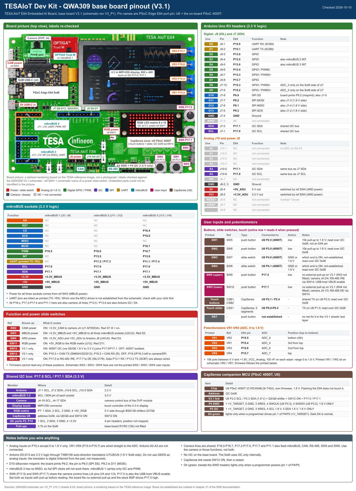

## 6. ส่วนที่ build มาแล้ว

ส่วนเหล่านี้ส่งมาเป็น static library ใน `lib/` แทนซอร์ส:

| ส่วน | ไลบรารี | คอร์ |
|---|---|---|
| การอนุมาน Edge AI: ทะเบียนโมเดล ชุดโมเดล และการโหลดโมเดลขณะทำงาน | `libbento_edge_ai.a` | CM55 |
| หน้าจอ HSM หน้า Edge AI และการเริ่มจอแสดงผล | `libbento_cm55.a` | CM55 |
| IPC หลัก: service, LCD, UI และ sensor hub | `libbento_ipc.a` | CM55 |
| การลงทะเบียน OPTIGA: CSR และ Protected Update | `libbento_hsm.a` | CM33_NS |

แต่ละไฟล์อยู่ใน `lib/<ส่วน>/` พร้อม `include/` ของตัวเอง `api.txt` ที่ระบุทุก symbol
ที่ export ออกมา `consumer_must_provide.txt` ที่ระบุสิ่งที่มันต้องการจากคุณ และ
`PROVENANCE.txt` เอกสารอ้างอิง API ของแต่ละส่วนอยู่ใน `docs/sdk/` และใน `docs/html/`

## 7. โค้ดของคุณควรอยู่ที่ใด

| ถ้าต้องการ | เริ่มที่ |
|---|---|
| เพิ่ม task เบื้องหลัง ไดรเวอร์ หรือข้อความไปคลาวด์ | `proj_cm33_ns/main.c` และ `bento_libs/claw/common/` |
| เพิ่มหรือแก้หน้าจอ | `proj_cm55/modules/page-components/<หน้า>/` ลงทะเบียนใน `_core/sensorhub_ui.c` และเพิ่มการ์ดใน `_core/page_home.c` (ต้องทำทั้งสองที่เสมอ) |
| อ่านลูกบิด ปุ่ม และ CapSense ของบอร์ดฐาน | `proj_cm55/modules/cm55_sensor_poll/` และบท J7 |
| เก็บค่าตั้ง | `bento_libs/claw/common/storage_c/bento_storage.h` |

เอกสารใน `docs/html/th/` (ภาษาไทย) และ `docs/html/` (ภาษาอังกฤษ) อธิบายแต่ละเรื่อง
พร้อมตัวอย่างโค้ดจากซอร์สในแพ็กเกจนี้

## 8. สัญญาอนุญาต

- ซอร์สของ TESAIoT ในแพ็กเกจนี้ใช้สัญญาอนุญาต **Apache License 2.0**: `LICENSE`
  (คำแปลภาษาไทย: `LICENSE-TH.md`) พร้อม `NOTICE`
- archive ทั้ง 5 ไฟล์ใน `lib/` **ไม่อยู่** ภายใต้สัญญาอนุญาตนั้น `NOTICE` บอกว่าใช้
  เงื่อนไขใด
- โค้ดของบุคคลที่สามใช้สัญญาอนุญาตของตัวเอง ได้แก่ BSP และไลบรารีของ Infineon,
  LVGL, littlefs, ฟอนต์ และอื่น ๆ ระบุไว้ใน `THIRD_PARTY.md` และข้อความประกาศอยู่ใน
  `THIRD_PARTY_NOTICES.md`
- โมเดล DEEPCRAFT™ Studio ใน `proj_cm55/modules/ai_models/` เป็นลิขสิทธิ์ของ
  Imagimob AB บริษัทในเครือ Infineon Technologies สงวนสิทธิ์ทั้งหมด ที่นี่ให้เครดิต
  ไว้ ไม่ได้อนุญาตต่อ หากจะใช้ในสินค้าให้ตกลงกับ Infineon ก่อน
  (`proj_cm55/modules/ai_models/README.md`)

## 9. สิ่งใหม่ในรุ่น 1.12.0

- **หน้า GPIO & RGB Matrix:** ชื่อขากำกับทุกอินพุต ลูกบิดแสดงเป็น mV (0 ถึง 1800)
  และค่า raw สถานะการเชื่อมต่อ CapSense และ SW1-SW4 เมื่อตัวควบคุม CapSense ใช้
  เฟิร์มแวร์ที่ใช้ protocol 0x0D หรือ 0x0E (ทดสอบการถอดรหัสบนเครื่องคอมพิวเตอร์เท่านั้น
  ต้องเปิด SW12 แล้วเริ่มระบบใหม่)
- **Sensor Dashboard:** วาดบรรทัด CapSense ใหม่เฉพาะเมื่อค่าเปลี่ยน ภาพจึงไม่กระพริบ
- **ตอนเริ่มระบบ:** ลองเริ่ม BMI270, DPS368 และ SHT40 ได้ 4 ครั้ง ก่อนจะปิดแถวของ
  เซนเซอร์นั้นไปตลอดการบูต
- **เอกสาร:** บทใหม่ J7 เรื่องบอร์ดฐาน QWA309, README ฉบับนี้พร้อมภาพทุกหน้าและแผนผังขาของบอร์ดฐาน และวิธีใช้ clone กับ
  zip ข้างต้น
- archive ทั้ง 5 ไฟล์ใน `lib/` ไม่เปลี่ยนจากรุ่น 1.11.0
